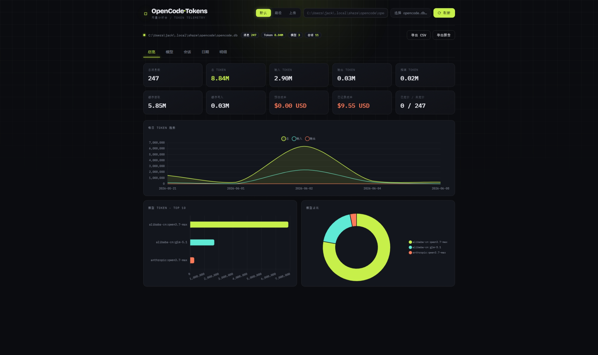

# OpenCode Usage Statistics (Web)

基于 **FastAPI** 的网页应用，用来分析 `opencode.db` 中的消息与 token 使用情况，并把结果以网页形式呈现，
支持**导出对话 token 使用分析报告（HTML）**。

## 功能

- 从 OpenCode SQLite 数据库读取消息、token 与已记录成本
- 四类聚合：总览 / 按模型 / 按会话 / 按日期
- 定价引擎：内置价格表（`app/core/prices.json`）、`prices.local.json` 本地覆盖、flat 与
  session-tiered 两种定价模式、多币种分别汇总（`estimated_cost_totals`）
- 单页网页界面：汇总卡片、Chart.js 图表（每日趋势 / 模型占比 / 模型柱状）、分页明细
- 数据来源三选一：**默认路径** / **手填路径** / **上传 opencode.db**（上传无大小限制，大文件分块流式写入磁盘）
  - 上传文件存于系统临时目录，**自动清理**：默认空闲 6 小时未访问即删除；正在分析的文件每次访问会续期，不会被误删。
    服务启动时也会清扫上一轮残留。可用环境变量 `OPENCODE_UPLOAD_TTL_SECONDS` 调整空闲时长。
- 导出：
  - **CSV（zip）**：summary / by_model / by_session / by_day / raw_messages（UTF-8 BOM，Excel 可直接打开）
  - **HTML 分析报告**：自包含单文件（内嵌图表与数据），支持「全部对话」/「单会话」/**「勾选多个会话合并导出到一份报告」**，可在浏览器打印为 PDF
    - 在「会话」标签页勾选多个会话后点「导出选中报告」，报告总览为所选会话的合并统计，同时按会话分行明细

默认数据库路径：`%USERPROFILE%\.local\share\opencode\opencode.db`

## 安装

需要 Python 3.12+。

```bash
uv pip install -e ".[dev]"
# 或 python -m pip install -e ".[dev]"
```

## 启动

```bash
python run.py            # 默认 http://127.0.0.1:8000
python run.py --reload   # 开发热重载
# 或
uvicorn app.main:app --reload
```

浏览器打开 http://127.0.0.1:8000 ，选择数据来源后点击「加载分析」。

## API

| 方法 | 路径 | 说明 |
| --- | --- | --- |
| GET  | `/api/db/default` | 默认数据库路径与是否存在 |
| GET  | `/api/usage` | 完整分析数据（`db_path` 或 `token` 可选） |
| GET  | `/api/sessions/{id}` | 单会话分析数据 |
| POST | `/api/upload` | 上传 opencode.db，返回 `token` |
| GET  | `/api/export/csv` | 5 个 CSV 打包为 zip |
| GET  | `/api/export/report` | HTML 报告（`session_id` 可重复传入，合并多个会话；不传则为全部） |

## 价格机制

- 内置价格表：`app/core/prices.json`
- 本地覆盖：`app/core/prices.local.json`（存在时自动合并，标记为 override）
- 多币种时使用 `estimated_cost_totals` 分币种汇总，避免错误相加

## 测试

```bash
python -m pytest
```

## 目录结构

```text
app/
  core/        # 纯分析逻辑 + 报告生成
  static/      # 单页前端 + Chart.js
  api.py       # FastAPI 路由
  config.py    # 数据库路径解析 / 上传管理
  main.py      # FastAPI app
run.py         # 启动入口
tests/
```
## 参考
- https://github.com/Sakura1618/OpenCode-Token